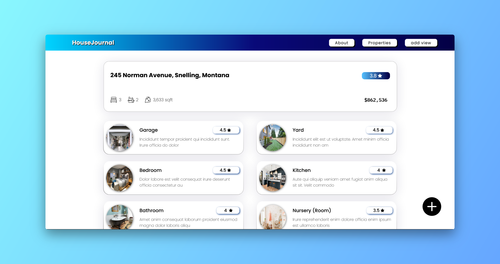

<h1 style="text-align:center;margin-bottom:50px;">House Journal</h1>

Add info about various parts of all houses/properties you view and compare to make the best choice when buying a new house/property.

 

## How to Access

#### Deployed Using Vercel at : https://house-journal.vercel.app/

To run locally:

1. npm run start
2. npm run server

## Built With

Used the following:

- ReactJS
- MongoDB
- NodeJS
- ExpressJS
- Typescript
- styled-components
- MaterialUI

## Authors:

Aman Kapoor - [@kapaman9](https://twitter.com/kapaman9)
